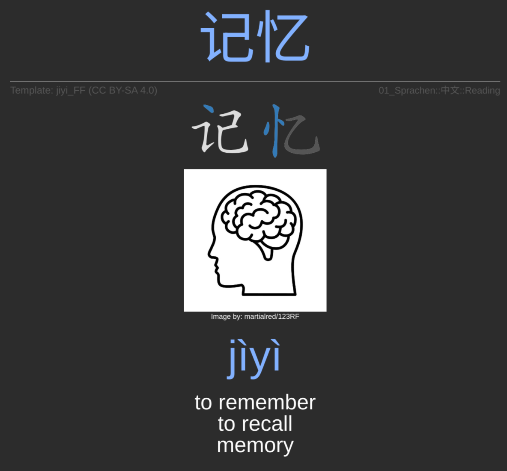

# jiyi_FF (记忆)

Anki templates optimized for Sinitic languages (Mandarin, Cantonese), heavily influenced by the **Fluent Forever** methodology. Designed for a visual-first, inductive approach to language acquisition.

## Preview
#### Example of Read Card Type

## Card Types

* **Read:** Character recognition and meaning.
* **Recall:** Active production from imagery/definitions.
* **Listen:** Auditory comprehension.
* **Write:** Handwriting and stroke order practice.

## Setup

1. Create a new **Note Type** in Anki.
2. Create four **Card Types**: Read, Recall, Listen, and Write.
3. For each card, paste the corresponding `front.html` and `back.html` from the `templates/` folders.
4. Copy the content of `templates/shared/styling.css` into the **Styling** section (this CSS is shared across all types).

## License

Licensed under **CC BY-SA 4.0**.

*Disclaimer: This project is an independent creation and is not affiliated with or endorsed by Gabriel Wyner or Fluent Forever.*

Created by [Maxim Möllhoff](https://github.com/maxim-moellhoff)
